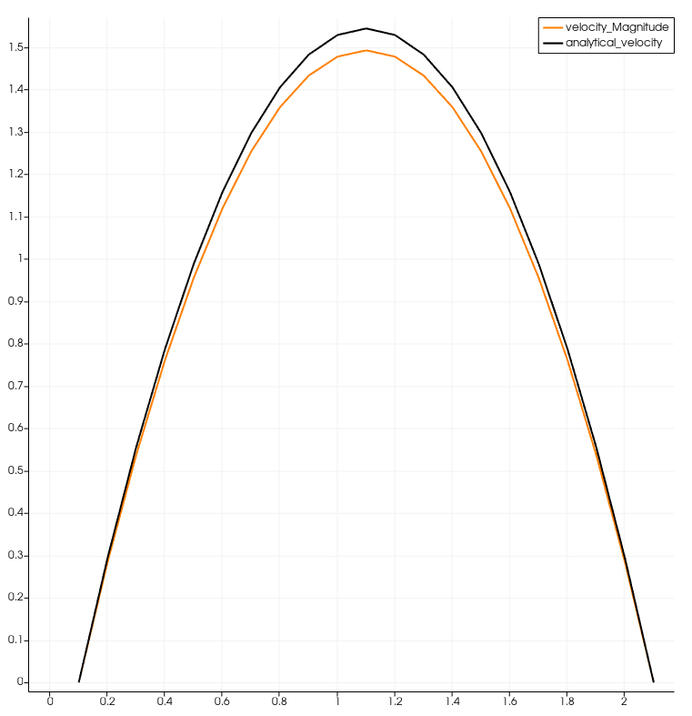
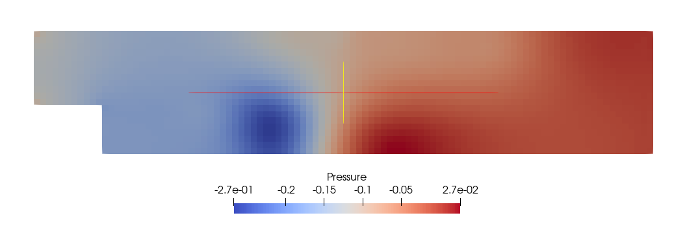

# Worksheet 2 - Arbitrary Geometries and Energy Transport for the Navier-Stokes Equations

Build instructions.

```shell
mkdir build && cd build
cmake ..
make
```

## Plane Shear Flow

Run the code with the "Plane Shear Flow" case:

```shell
./fluidchen ../example_cases/ShearFlow/ShearFlow.dat
```

### Velocity Field


#### Analytical Solution Comparison
At x = 5.0 


### Pressure Field


## Karman Vortex Street

Run the code with the "Karman Vortex Street" case:

```shell
./fluidchen ../example_cases/ChannelWithObstacle/ChannelWithObstacle.dat
```

### Velocity Field


<!-- ### Streamlines
 -->

### Pressure Field


## Flow over a step

Run the code with the "Flow over a step" case:

```shell
./fluidchen ../example_cases/ChannelWithBFS/ChannelWithBFS.dat
```

### Velocity Field


### Pressure Field



## Natural Convection

Run the code with the "Natural Convection" case;

```shell
./fluidchen ../example_cases/NaturalConvection/NaturalConvection.dat
```

## Fluid Trap

Run the code with the "Fluid Trap" case:

```shell
./fluidchen ../example_cases/FluidTrap/FluidTrap.dat
```

### Velocity Field


## Rayleigh Benard Convection

Run the code with the "Rayleigh Benard Convection" case:

```shell
./fluidchen ../example_cases/RayleighBenard/RayleighBenard.dat
```
