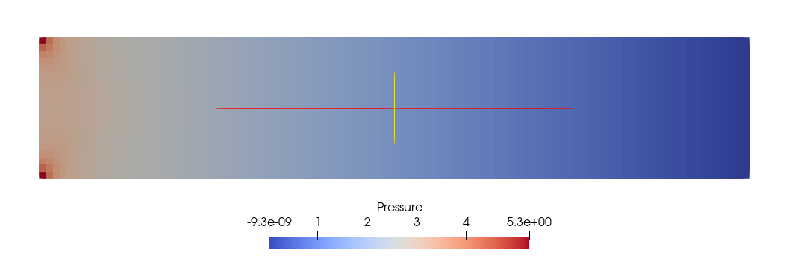

# Worksheet 2 - Arbitrary Geometries and Energy Transport for the Navier-Stokes Equations

Build instructions.

```
mkdir build && cd build
cmake ..
make
```

## Plane Shear Flow

Run the code with the "Plane Shear Flow" case:

```
./fluidchen ../example_cases/ShearFlow/ShearFlow.dat
```

#### Velocity Field


#### Pressure Field



## Karman Vortex Street

Run the code with the "Karman Vortex Street" case:

```
./fluidchen ../example_cases/ChannelWithObstacle/ChannelWithObstacle.dat
```

#### Velocity Field


<!-- ### Streamlines
 -->

#### Pressure Field


## Flow over a step

Run the code with the "Flow over a step" case:

```
./fluidchen ../example_cases/ChannelWithBFS/ChannelWithBFS.dat
```

#### Velocity Field


#### Pressure Field


## Natural Convection

### Case (a) - high $\nu$

Run the code with the "Natural Convection" case with high Kinematic Viscosisty $\nu = 0.001$ ;

```
./fluidchen ../example_cases/NaturalConvection/NaturalConvection_a.dat
```

#### Velocity Field


#### Temperature Field


### Case (b) - low $\nu$

Run the code with the "Natural Convection" case with low Kinematic Viscosisty $\nu = 0.0002$;

```
./fluidchen ../example_cases/NaturalConvection/NaturalConvection_b.dat
```

#### Velocity Field


#### Pressure Field


## Fluid Trap

Run the code with the "Fluid Trap" case:

```
./fluidchen ../example_cases/FluidTrap/FluidTrap.dat
```

#### Velocity Field


## Rayleigh Benard Convection

Run the code with the "Rayleigh Benard Convection" case:

```
./fluidchen ../example_cases/RayleighBenard/RayleighBenard.dat
```
