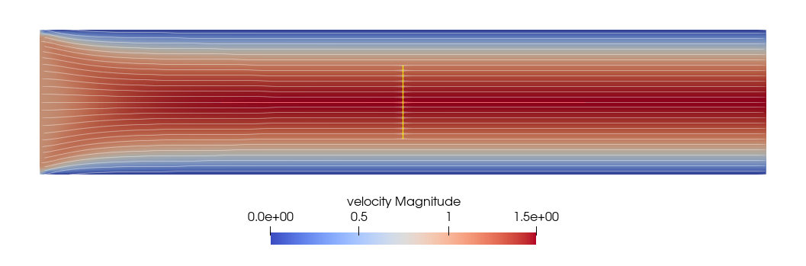
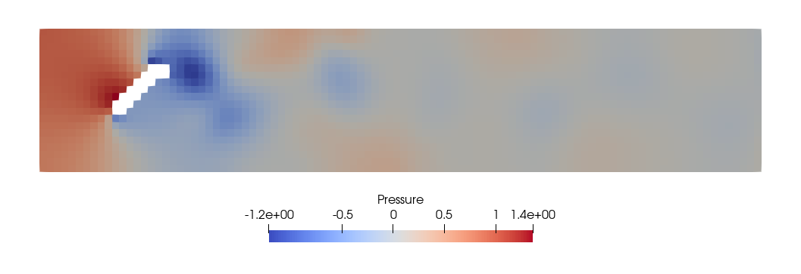
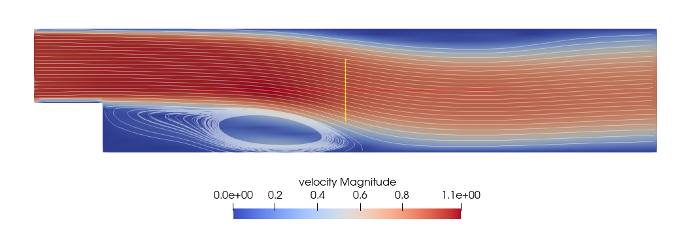

# Worksheet 2 - Arbitrary Geometries and Energy Transport for the Navier-Stokes Equations

Build instructions.

```
mkdir build && cd build
cmake ..
make
```

Run different cases:

- **Plane Shear Flow**
  ```
  ./fluidchen ../example_cases/ShearFlow/ShearFlow.dat
  ```
- **Karman Vortex Street**
  ```
  ./fluidchen ../example_cases/ChannelWithObstacle/ChannelWithObstacle.dat
  ```
- **Flow over a step**
  ```
  ./fluidchen ../example_cases/ChannelWithBFS/ChannelWithBFS.dat
  ```
- **Natural Convection**
  - Case (a) - high $\nu$
    ```
    ./fluidchen ../example_cases/NaturalConvection/NaturalConvection_a.dat
    ```
  - Case (b) - low $\nu$
    ```
    ./fluidchen ../example_cases/NaturalConvection/NaturalConvection_b.dat
    ```
- **Fluid Trap**
  ```
  ./fluidchen ../example_cases/FluidTrap/FluidTrap.dat
  ```
- **Rayleigh Benard Convection**
  ```
  ./fluidchen ../example_cases/RayleighBenard/RayleighBenard.dat
  ```

## Plane Shear Flow

#### Velocity Field



#### Analytical Solution Comparison (x = 5.0)


#### Pressure Field


## Karman Vortex Street

#### Velocity Field


<!-- ### Streamlines
 -->

#### Pressure Field



## Flow over a step

#### Velocity Field



#### Pressure Field


## Natural Convection

### Case (a) - $\nu=0.001$

#### Velocity Field


#### Temperature Field


### Case (b) - $\nu = 0.0002$

#### Velocity Field


#### Pressure Field


## Fluid Trap

#### Velocity Field


## Rayleigh Benard Convection
