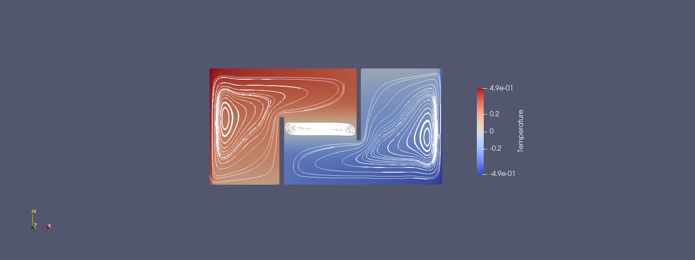

# Worksheet 3 - Parallelization

Build instructions.

```
mkdir build && cd build
cmake ..
make
```
Run different cases: iproc and jproc can be varied in the respective sh files 

with the format: -np [number of all processors] [path to file] [iproc] [jproc]


- **Lid-driven cavity**
  ```
  ./mpi_liddriven.sh
  ```
- **Fluidtrap**
  ```
  ./mpi_fluidtrap.sh
  ```

## Lid-driven cavity 
compare resuls at final time , convergence behavior (number of iterations)

#### (iproc, jproc) = (1,1)


#### (iproc, jproc) = (2,2)


#### (iproc, jproc) = (1,4)


#### (iproc, jproc) = (3,2)


## Fluidtrap

#### (iproc, jproc) = (1,1)



#### (iproc, jproc) = (2,3)


#### (iproc, jproc) = (3,2)


## Performance Analysis

#### Strong Scaling with Rayleigh Benard case
maximum speedup, parallel efficiency

#### Weak Scaling with Lid-driven cavity case