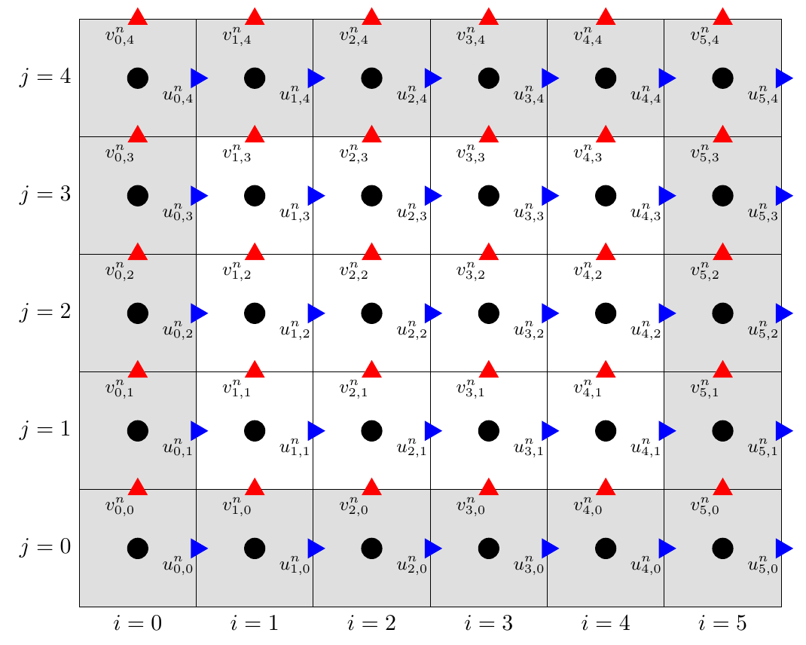

# Boundaries in fluidchen

One key aspect for obtaining correct fluid simulations are _Boundary Conditions_. Many errors in CFD result from wrongly implemented or wrongly chosen boundary conditions.

In the fluidchen-skeleton we provide a base class `Boundary` which is defined in `Boundary.cpp`.
We want to create a specific boundary class for each type of boundary. Already predefined, you will find the `FixedWallBoundary` and `MovingWallBoundary` classes which both inherit from the parent class `Boundary`.

Each boundary class needs to implement the method `apply(Field)` which is called to set the boundary values for the required fields according to the nature of the boundary.

How exactly this will be implemented is up to you, but here are some hints:

- You can access the boundary cells by iterating over the `_cells` vector.
- A `Cell` object has many useful methods for identifying its location in the grid.
  - The `Cell.is_border(border_position)` returns true if the cell has a border to a fluid cell in the direction of `border_position`.
  - The `Cell.borders()` method returns a vector with all sides, where the cell has a bordering fluid cell.
  - The `Cell.neighbor(border_position)` returns a pointer to the neighboring cell.
  - The  `Cell.i()` and `Cell.j()` methods return the corresponding indices of the cell.
- You can access the field values for a certain cell by two-dimensional indexing, e.g. `field.p(i, j)`.
- Remember we use a basic cartesian grid indexing.

Lastly, it is highly recommended to always have this image from the lecture notes in mind when implementing boundary conditions:

