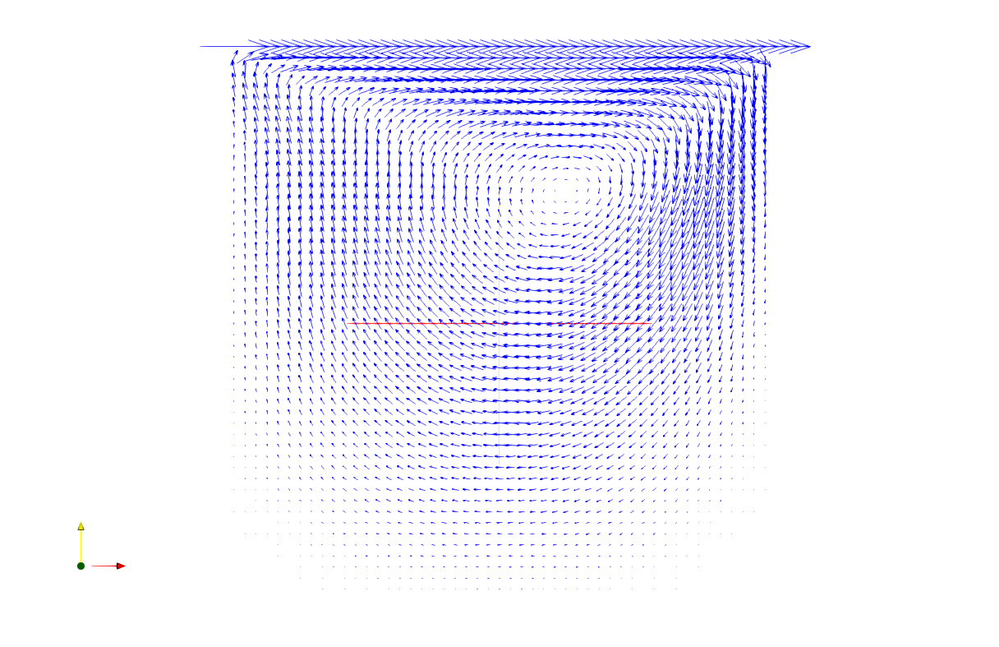
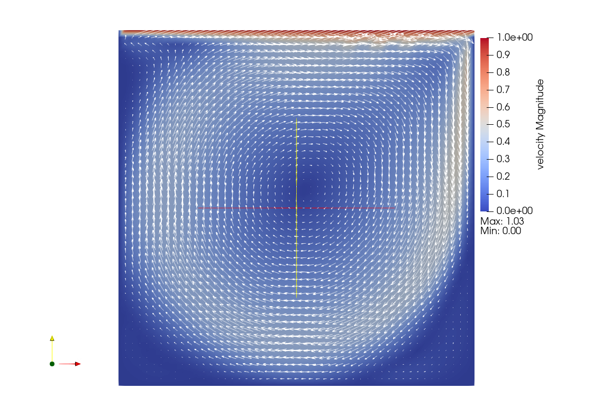

# Worksheet 1 - Lid Driven Cavity Flow

Build instructions.

```shell
mkdir build && cd build
cmake ..
make
```

Run the code with the Lid Driven Cavity case.

```shell
./fluidchen ../example_cases/LidDrivenCavity/LidDrivenCavity.dat
```

## Visualizations

The following images created with ParaView depict the results of the simulation with the parameters in example_cases. The velocity field shows that the velocity of the fluid decreases with increasing distance from the moving wall on the top. The fluid directly under the moving wall has the same velocity as the moving lid. The streamlines follow the expected paths, creating a circulation in the cavity and an accumulation point at the left bottom corner. The right upper corner has the highest pressure, in contrast to the light upper corner with the lowest pressure. The pressure field seems plausible, the flow is being deflected from the right upper corner, since the flow collides with the right boundary.

### Velocity Field


### Direction Fieldimgs



### Streamlines


### Pressure Field


## SOR's behavior depending on relaxation parameter omega

The following image shows the behavior of SOR algorithm depending on various values for the relaxation parameter. It shows that with small omega such as 0.2 the convergence is very slow, more timesteps are necessary in order to decrease the iteration numbers. The value 1.7 used in the simulation for the example file converges faster than the other chosen time steps. If we run the simulation with an omega of 2.0, it leads to an unstable simulation.


## Algorithm's behavior depending on time step dt (fixed timestep)

According to the stability conditions for the timesteps dt, the fixed dt should not exceed 0.01. If the fixed timestep is larger than 0.01, the simulation becomes numerically unstable and diverges.

## Influence of gridsize on convergence (fixed timestep)

The fixed dt should fulfill all three stability conditions mentioned in equation (12). The first stability condition would be guaranteed until imax = 64, but the second/third conditions (CFL conditions) are already not fulfilled with imax = 32. With a fixed timestep of dt = 0.05 and nu = 0.001, convergence should be only observed with imax = jmax = 16. This expectation matches with the observations made with the simulation, it diverges for all cases expect with imax = jmax = 16.

## Kinematic viscosity (with adaptive timestep)

Interpretation: The kinematic viscosity affects the transfer of inertia from one layer of fluid (cell) to another. Increasing the kinematic viscosity leads to a more uniform flow field and vice versa. In the case of nu = 0.01, the direction field at the top moving wall boundary is most parallel, compared to other cases. In the pressure field for nu=0.0005 we can see a negative pressure zone in the middle of the large vortex, which is physically expected.

Decreasing the kinematic viscosity leads to a higher number of iterations needed to obtain the required residual in the SOR pressure solver. The case with the smallest viscosity fails to achieve steady state.

### nu = 0.01


### nu = 0.002


### nu = 0.0005



### nu = 0.0001


### Pressure field, nu = 0.00005


### Convergence


## Difficulties

When calculating the divergence of the velocity field in ParaView, it can be seen that the continuity condition or divergence freeness is not fulfilled at both top corners. Seemingly, there is a fluid source at the top left corner and a sink on the top right corner. The authors think that this might be a cause for numerical inaccuracies, however the source of the problem could not be found at present.
