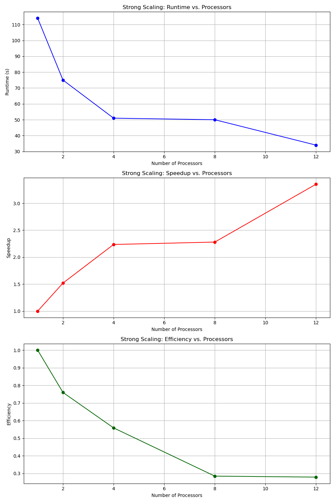
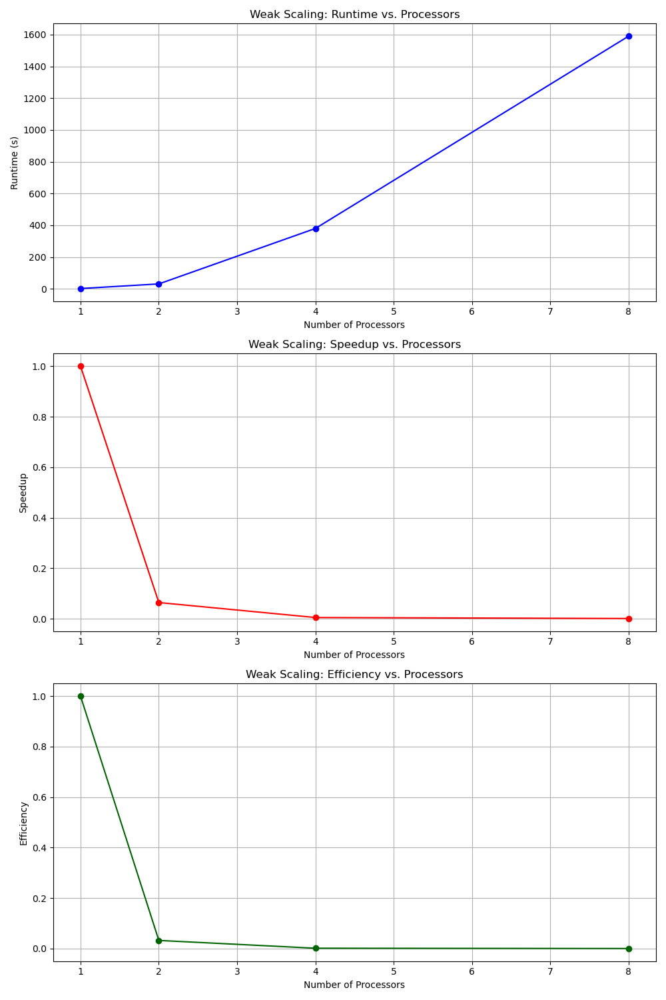

# Worksheet 3 - Parallelization

Build instructions:

```shell
mkdir build && cd build
cmake ..
```

Run different cases:

- **Lid-driven cavity**
  ```shell
  ../example_cases/LidDrivenCavity/mpi_liddriven.sh
  ```
- **Fluid Trap**
  ```shell
  ../example_cases/FluidTrap/mpi_fluidtrap.sh
  ```
  **Plane Shear Flow**
  ```shell
  ../example_cases/ShearFlow/mpi_shearflow.sh
  ```
- **Karman Vortex Street**
  ```shell
  ../example_cases/ChannelWithObstacle/mpi_obstacle.sh
  ```
- **Flow over a step**
  ```shell
  ../example_cases/ChannelWithBFS/mpi_BFS.sh
  ```
- **Natural Convection**
  - Case (a) - high $\nu$
    ```shell
    ../example_cases/NaturalConvection/mpi_convectionA.sh
    ```
  - Case (b) - low $\nu$
    ```shell
    ../example_cases/NaturalConvection/mpi_convectionB.sh
    ```
- **Rayleigh Benard Convection**
  ```shell
  ../example_cases/RayleighBenard/mpi_rayleighBenard.sh
  ```
  If you encounter permission issues when running the `.sh` files, run the following command:

```
chmode +x [path to file]
```

then run again the file as above.

The number of processors involved and the consequent domain decomposition can be modified in the `.sh` according to the following format:

```
mpirun --oversubscribe -np [number of all processors] [path to file] [iproc] [jproc]
```

where `iproc` and `jproc` stand for the number of processors along `x` and `y` direction respectively.

`--oversubscribe` allows the oversubscription of processor cores. This means you can start more MPI processes than the number of physical CPU cores available on the machine.

For sequential execution:

```
mpirun --oversubscribe -np 1 [path to file] 1 1
```

## Results Validation

### Lid-driven cavity

When running the simulation with a domain size of imax = 300 and jmax = 300, the time step size becomes too small, causing the SOR method to struggle with convergence. This results in the maximum number of iterations being exceeded at each time step.

To address this issue, we carried out the simulation with a reduced domain size of `imax` = 160 and `jmax` = 160 and the following configurations:

| Configuration        | Processors | Runtime (s) | Speedup S(p) | Efficiency E(p) |
| -------------------- | ---------- | ----------- | ------------ | --------------- |
| **Sequential (1,1)** | 1          | 523s        | -            | -               |
| **(2,2)**            | 4          | 304s        | 1.72         | 0.43            |
| **(1,4)**            | 4          | 388s        | 1.35         | 0.34            |
| **(3,2)**            | 6          | 252s        | 2.08         | 0.35            |

### Fluidtrap

The analysis was performed with a domain size of `imax` = 100 and `jmax` = 50 and the following configurations:

| Configuration        | Processors | Runtime | Speedup S(p) | Efficiency E(p) |
| -------------------- | ---------- | ------- | ------------ | --------------- |
| **Sequential (1,1)** | 1          | 14s     | -            | -               |
| **(2,3)**            | 6          | 4s      | 3.5          | 0.58            |
| **(3,2)**            | 6          | 3s      | 4.67         | 0.78            |

## Performance Analysis

### Strong Scaling with Rayleigh Benard case

For the strong scaling analysis, we used the Rayleigh-Bénard case. The analysis was performed with a domain size of `imax` = 40 and `jmax` = 18 and the following configurations:

| Configuration        | Processors | Runtime (s) | Speedup S(p) | Efficiency E(p) |
| -------------------- | ---------- | ----------- | ------------ | --------------- |
| **Sequential (1,1)** | 1          | 114s        | -            | -               |
| **(2,1)**            | 2          | 75s         | 1.52         | 0.76            |
| **(2,2)**            | 4          | 51s         | 2.24         | 0.56            |
| **(4,2)**            | 8          | 50s         | 2.28         | 0.57            |
| **(4,3)**            | 12         | 34s         | 3.35         | 0.56            |



#### Maximum Speedup and Efficiency

- **Maximum Speedup**: The maximum speedup achieved was 3.35 with 12 processors.
- **Maximum Efficiency**: The highest efficiency observed was 0.76 with 2 processors.

#### Considerations

As the number of processors increases, the runtime consistently decreases, indicating effective parallelization. The speedup increases with the number of processors, with a peak speedup of 3.35 using 12 processors.
Efficiency decreases as the number of processors increases, with the highest efficiency of 0.76 observed with 2 processors, indicating loss of performance due to overhead and communication costs.

### Weak Scaling with Lid-driven cavity case

For the strong scaling analysis, we used the Lid-driven cavity case and the following configurations:

| Configuration        | Domain Size | Processors | Runtime (s) | Speedup S(p) | Efficiency E(p) |
| -------------------- | ----------- | ---------- | ----------- | ------------ | --------------- |
| **Sequential (1,1)** | 40          | 1          | 2s          | -            | -               |
| **(2,1)**            | 80          | 2          | 31s         | 0.06         | 0.03            |
| **(2,2)**            | 160         | 4          | 380s        | 0.005        | 0.00125         |
| **(3,2)**            | 240         | 8          | 1590s       | 0.00126      | 0.0001575       |



#### Considerations

As the number of processors increases, there is a significant increase in runtime. This suggests that the parallel communication overhead outweighs the benefits of dividing the work among multiple processors
